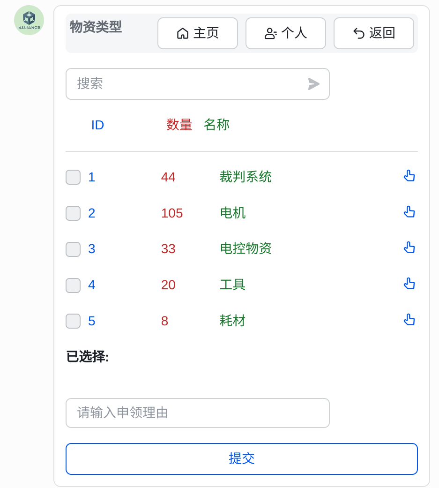

# NJUST 物资管理系统(施工中)

[toc]

## 背景

​	历届队内物资管理由专人负责，管理办法与具体效果全看当届负责人的能力。然而，在2024赛季，由于物资管理不善，导致项目进度受阻、经费支出增加、场上缺少备件以及电池过放等问题。

​	经过队长团的商议，决定在25赛季开发一个物资管理系统，以解决长期困扰队伍的物资管理问题。

## 希望实现的功能

通过分析各项目组的上赛季物资需求，该项目将实现以下功能：

- 对器材(电机、裁判系统等)实行`一物一码`的规则，任何人使用物品需发起审批说明用途，管理员同意后方可领取。

  > 系统中应存储每个物品的详细信息，包括但不限于物品名称、类别、当前位置、状态等
  >
  > 物品条码由热敏打印机打印条形码和对应物品id贴在物品上
  >
  > 如可能，使用RFID标签纸，开发对应硬件设备，实现物品的室内定位等高级功能。

- 对电阻电容、螺丝等消耗品，任何人都可以直接使用，但一旦发现快用完了，应通过接口修改状态为"即将耗尽"，并通知管理员补货。

  > 应开发一个功能，可以直接通过工程文件或BOM表，与数据库内物资存量进行匹配，提示是否需要另行购买

- 机械发加工件，及其他各组别的大额开支，应提交审核，由对应组别负责人同意后才能付款，否则不予报销。由于各种即时通讯软件都具备该功能，系统主要起个记录的作用。

  > 该功能可选。

- 收集发票。

  > 可选。目前是使用飞书表格填写待报销的购买纪录，再打包电子发票交给财务负责人，这流程其实挺好的不用改（？）

## 施工平台

​	该项目选择`飞书`作为平台，在基础建设中参考了`南航开源的NUAA长空御风管理系统`。

​	功能验证期间采用`Python`作为主开发语言，使用`Flask框架`配合`Redis`、`Mysql`、`Celery`，通过配置`飞书机器人`调用相关Api向用户发送`消息卡片`实现物资仓库。

​	该仓库会提供`Dockerfile`和`docker_compose.yaml`。

> 在经历了初步功能验证后，我们决定后续工作重心挪至开发小程序或App中，以实现更多高级功能：
>
> - 直接扫描物品标签上的条形码，获取相关信息或申请该物品。
> - 支持更多个性化功能，比如上传BOM表
> - ~~美观好看~~

## 目前已实现的功能

- 基于消息卡片的物资仓库。具备搜索物资、查看物资信息、申领/归还物资的功能。只需要配置好后给物品贴上条码一一对应上就是可用的状态。

  

- 可以通过指令`/command`实现一些特殊操作

  

## 配置及使用教程

详见根目录下`配置指南.md`

## 通讯信息

欢迎骚扰

> QQ：1373987167
>
> mail: smoaflie@163.com

如果愿意分享队内物资管理经验，也欢迎交流。

## 一些声明

**本程序基于GNU GPL 3.0协议开放源代码，在使用源代码时请务必注意以下几点**

1. 任何基于本程序修改或衍生发布的代码应同样使用GPL 3.0协议开放源代码，并在显要位置提及本仓库。
2. 强烈建议其他以任何形式间接接触本程序的代码使用GPL 3.0协议开放源代码，并在文档中提及本仓库。
3. 若您将此代码用于盈利，则必须在显要位置说明此代码可以免费获得。
4. 您使用此代码及其衍生代码造成的一切后果本仓库不负任何责任。

## 鸣谢

感谢 [@bismarckkk](https://github.com/bismarckkk) 的 [NUAA长空御风管理系统](https://github.com/bismarckkk/management_system)

感谢 [@飞书](https://open.feishu.cn/?lang=zh-CN)	提供的开发平台及 [示例代码](https://open.feishu.cn/document/home/develop-a-bot-in-5-minutes/configuration)

感谢 [@Google开源项目风格指南](https://zh-google-styleguide.readthedocs.io/)

 