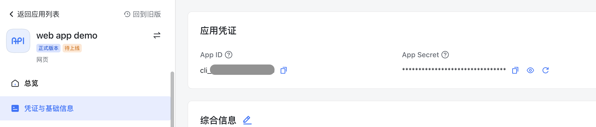
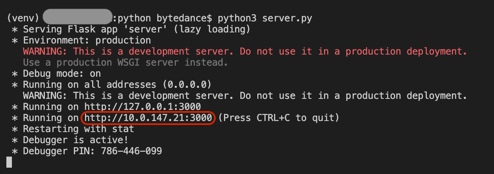
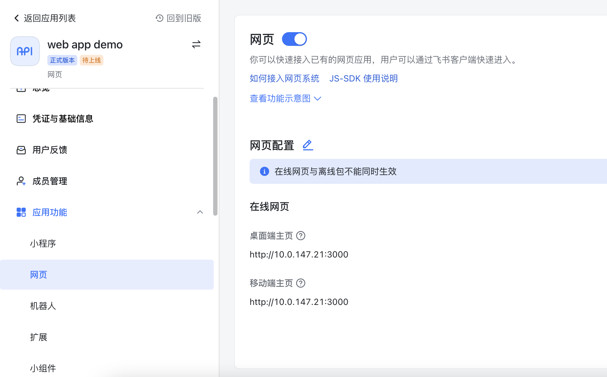
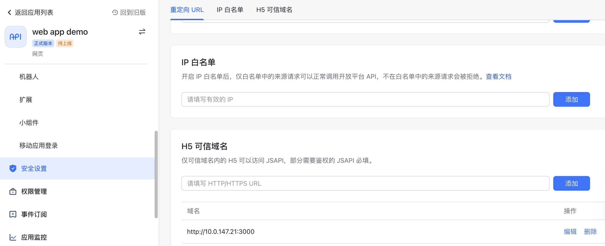
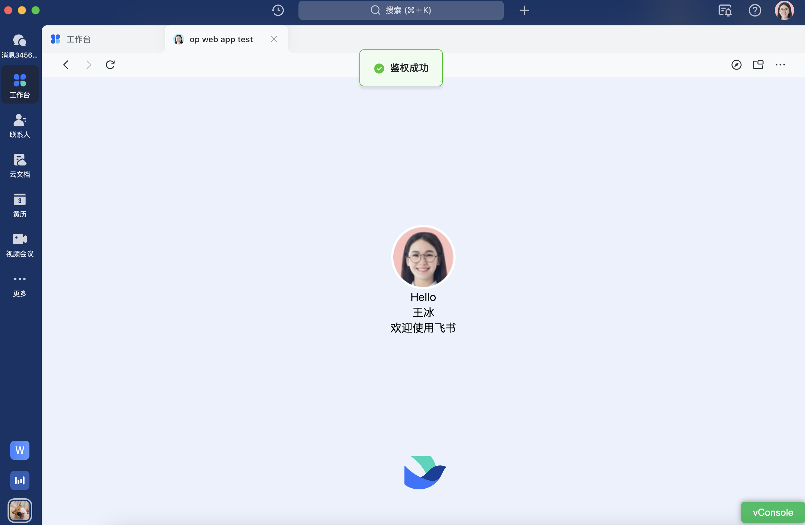
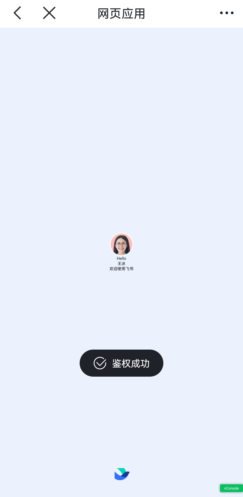

# 快速实现飞书客户端网页应用鉴权
## 1. 功能介绍
* 【鉴权】如果您需要调用 开放平台客户端API（JSAPI），为了数据安全，飞书需要先验证网页应用有权限访问的JSAPI范围，此过程称为鉴权。
* 如果需要开发一款在飞书客户端内调用需要鉴权的 JSAPI 的网页应用，可以参考本示例。
* 本示例使用飞书客户端 jssdk，在鉴权完成后，调用了 getUserInfo-获取已登录用户的基本信息、showToast-弹出消息提示框 这2个JSAPI。


## 2. 项目结构
> **public和templates**：前端模块，主要功能有：调取客户端API（JSAPI）获取用户信息、展示用户信息。
>
> **其他**：服务端模块，使用Flask构建，主要功能有：使用 App ID 和 App Secret 获取 tenant_access_token；使用 tenant_access_token 获取 jsapi_ticket；使用jsapi_ticket、随机字符串、当前时间戳、当前鉴权的网页URL 生成签名signature。

以下为目录结构与部分核心代码文件：
```
.
├── README.zh.md     ----- 说明文档
├── public
│   ├── svg     ----- 前端图形文件
│   ├── index.css     ----- 前端展示样式
│   ├── index.js     ----- 前端交互代码
├── templates
│   ├── index.html     ----- 前端用户信息展示页面
├── auth.py     ----- 服务端获取jsapi_ticket等
├── server.py     ----- 服务端核心业务代码
├── requirements.txt     ----- 环境配置文件
└── .env     ----- 全局默认配置文件，主要存储App ID和App Secret等
```
## 3. 运行前置条件

- 安装配置了[Python 3](https://www.python.org/)开发环境
- 安装配置了git工具


## 4. 准备工作

### 4.1 创建企业自建应用
在[开发者后台](https://open.feishu.cn/app/) 点击**创建企业自建应用**，创建成功之后，点击应用名称打开应用，点击**凭证与基础信息**切换页面，拿到 App ID 和 App Secret 信息。


### 4.2 下载代码
拉取最新代码到本地，并进入对应目录

```commandline
cd web_app_with_jssdk/python
```
## 5. 启动服务
### 5.1 修改环境变量

修改`.env`文件中应用凭证数据为真实数据。

```text
APP_ID=cli_9fxxxx00b
APP_SECRET=EX6xxxxOF
```
以上两个参数可以在[开发者后台](https://open.feishu.cn/app/) 点击**凭证与基础信息查看**。

**注意** 私有化部署时要修改`.env`文件中 FEISHU_HOST 为私有化部署所用的域名。
### 5.2 创建并激活虚拟环境

创建并激活一个新的虚拟环境

**mac/linux**

```commandline
python3 -m venv venv
. venv/bin/activate
```

**windows**

```commandline
python3 -m venv venv
venv\Scripts\activate
```

激活后，终端会显示虚拟环境的名称

```
(venv) **** python %
```

### 5.3 安装依赖

```commandline
pip install -r requirements.txt
```
### 5.4 启动项目并获取内网访问地址
运行服务端代码

```commandline
python3 server.py
```
启动后会生成临时域名，如下图所示，仅在同一局域网内有效。

## 6. 启动后配置工作
### 6.1 配置主页地址
点击**网页**切换页面，打开**启用网页**按钮，修改**网页配置**，**桌面端主页**和**移动端主页**都填写为5.4中获取的临时内网访问地址，比如此例中为`http://10.0.147.21:3000` 。


### 6.2 配置H5可信域名
为了飞书客户端内网页应用的安全可信，仅可信域名内的 H5 可以调用 JSAPI 获取数据，因此首先需要配置可信域名。打开开发者后台，点击左侧菜单【安全设置】，在**H5可信域名**中添加**需要调用 JSAPI 接口的页面所在域名**。

如此例中配置H5可信域名为5.4中获取的临时内网访问地址 `http://10.0.147.21:3000`。



### 6.3 应用版本创建与发布
打开开发者后台，点击左侧菜单：【应用发布】-【版本管理与发布】。点击创建版本，填写版本号、可用性状态等内容，点击保存，完成版本创建。

点击**申请线上发布**，完成应用发布。
  
  **注意**：仅可用性范围内用户能够打开应用。


## 6. 飞书客户端内体验网页应用
**注意**： 进行调试时手机和电脑需要在同一个局域网内。
### 桌面（PC）端
桌面（PC）端可以通过 **飞书**>**工作台**> 搜索应用名称> 打开应用 的方式体验Demo效果，如下图所示。


### 手机端

手机端通过 **飞书**>**工作台**> 搜索应用名称> 打开应用 便可体验Demo，并进行本地调试。如正常运行，应当显示当前客户端内登录用户的姓名与头像，并弹出“鉴权成功”。

**补充**: 手机端还可以通过扫描二维码（由5.4中获取的临时内网访问地址生成，可借助[飞书开发者工具](https://open.feishu.cn/document/uYjL24iN/ucDOzYjL3gzM24yN4MjN)）体验并调试Demo


