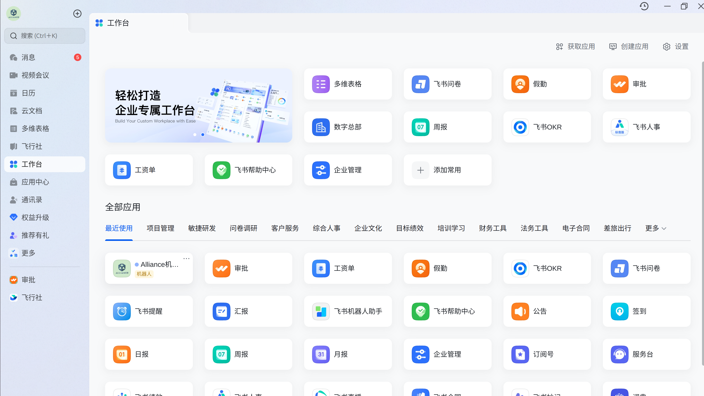
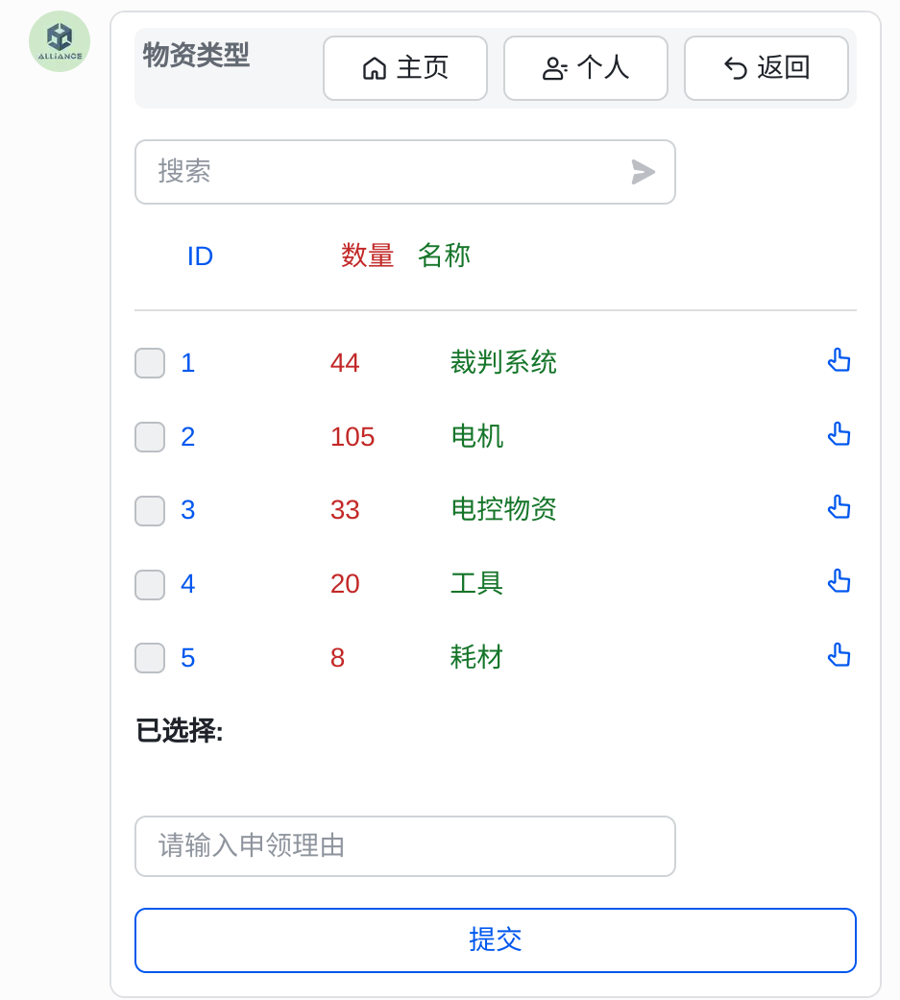
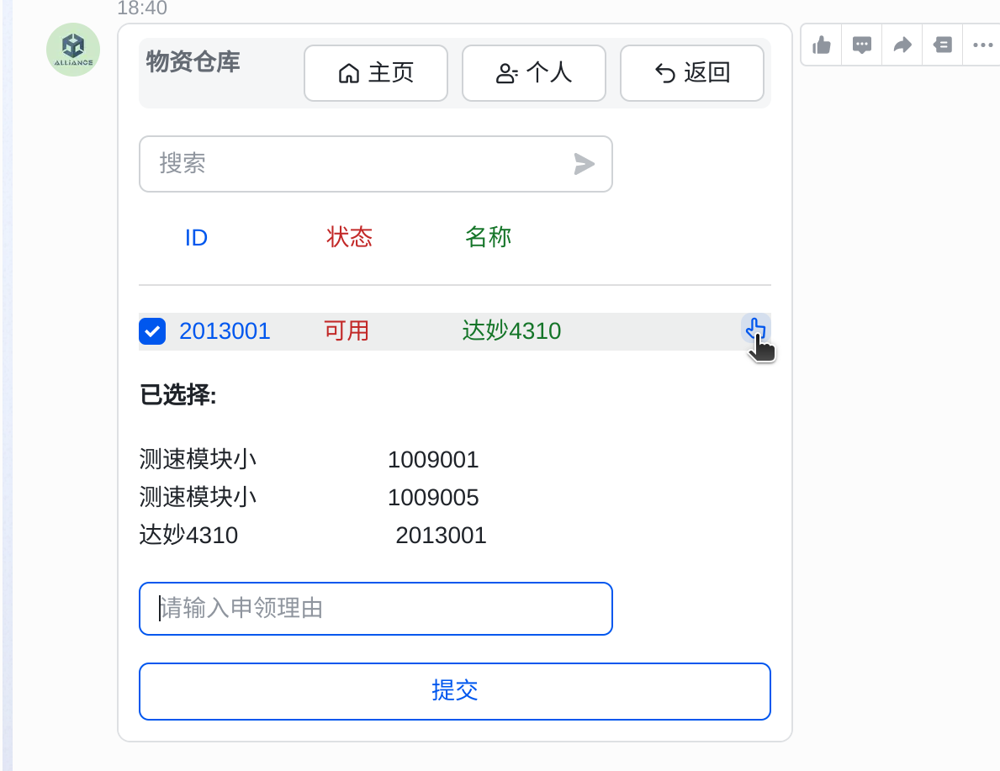
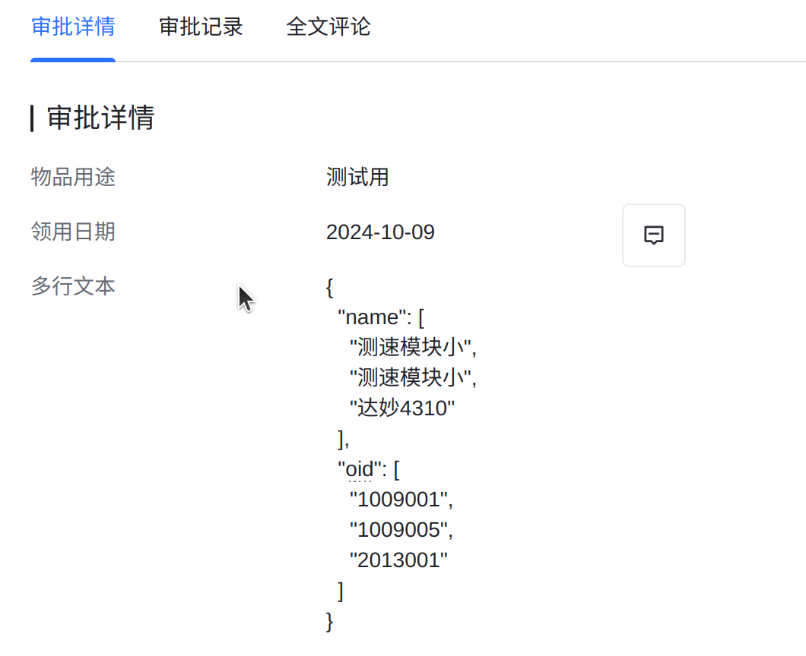
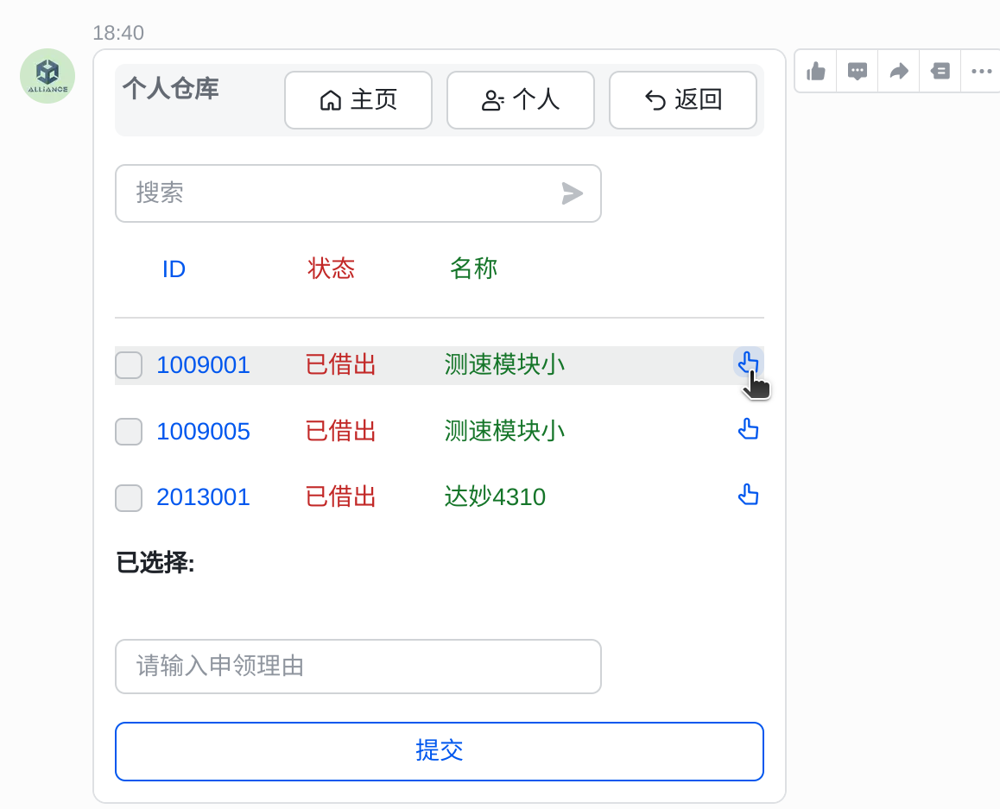
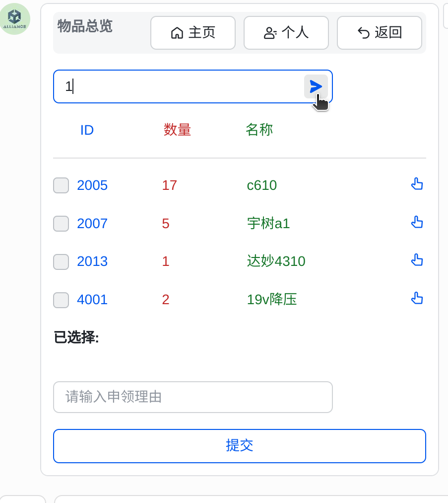

# 使用指南

(1.0.0功能验证版本)

按照`配置指南.md`配置完成后，通过飞书-工作台就能看到你的机器人了

点开它，界面和微信公众号类似

单击`物资查询`按键(可能为别的名，取决于后台的机器人菜单设置)，会发送给你一个消息卡片

> **每个用户与机器人的会话中只能拥有一个可活动的消息卡片**
>
> 如果你重复点击菜单键，应用会撤回上一张消息卡片

你可以通过每行右侧的`蓝色拇指`按钮进入下一级菜单

在最底层菜单，按钮的作用会变为显示物品详细信息，此时你可以点击物品进行`勾选`，勾选后的物品会在”已选择“的文本栏中显示出来

**已选择的物品列表会跟着卡片更新，如果你想一次性清除所有选择的物品，可以重新创建消息卡片**

当你选择好物品后，你可以输入物品用途后点击`提交`按钮。此时消息卡片会重置，并向管理员发送你的一个申请审批。

此时物品状态会变更为'审批中'，如果管理员同意了你的申请，对应物品的位置信息会显示你的名字:

你可以通过`个人`键进入查看自己名下的物品，此时蓝色拇指按键可以归还物品

你还可以通过`搜索`查看仓库内的物品

