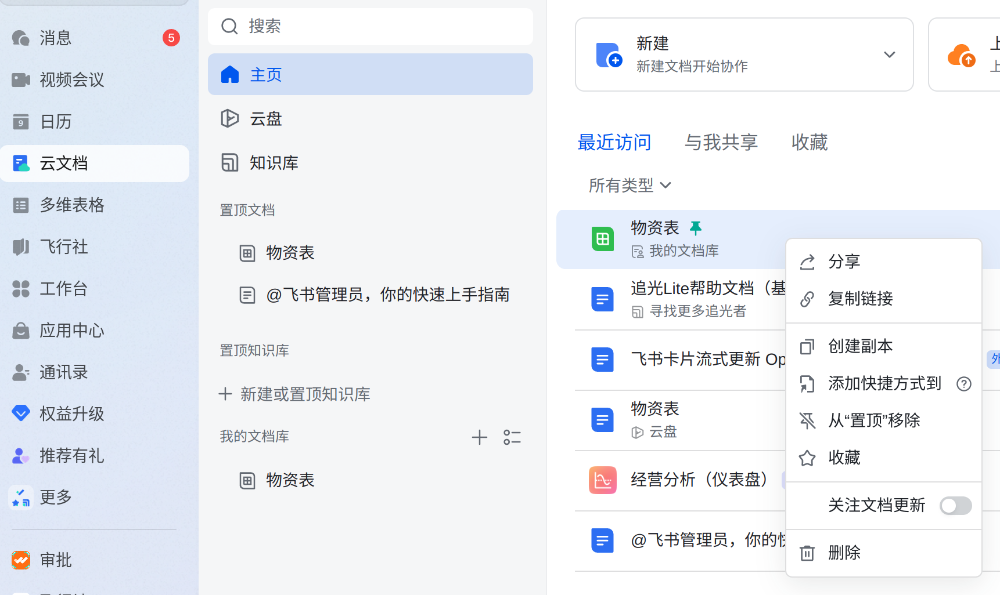
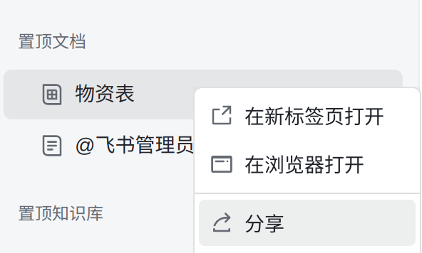
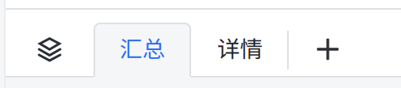
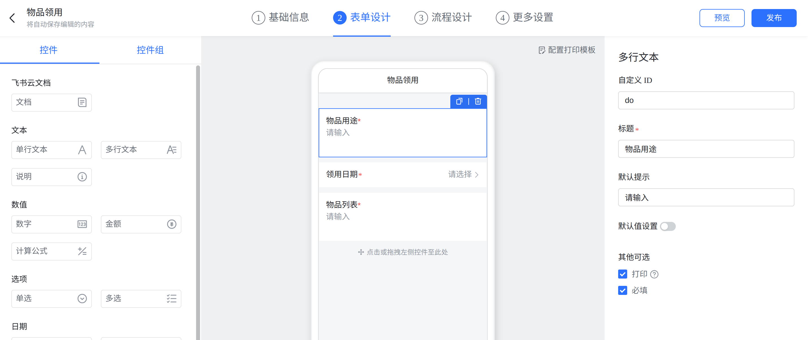
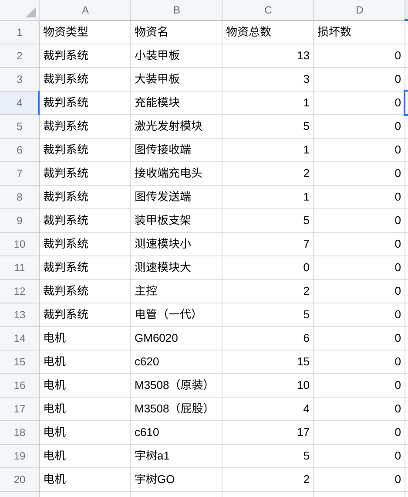
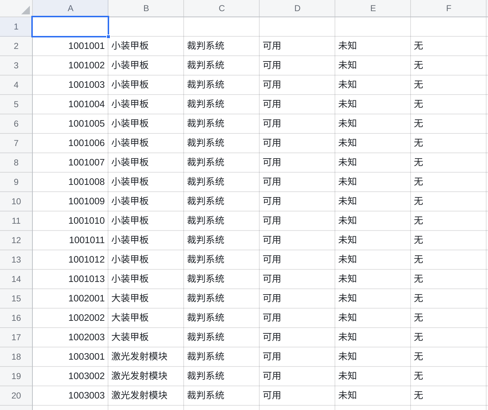
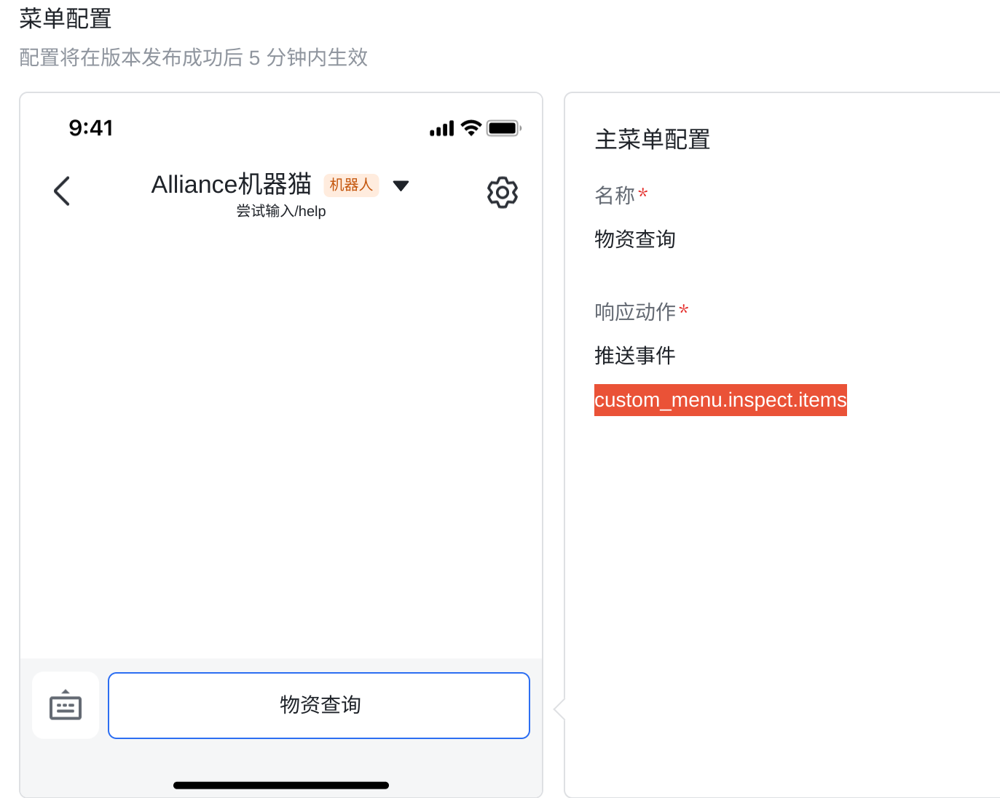
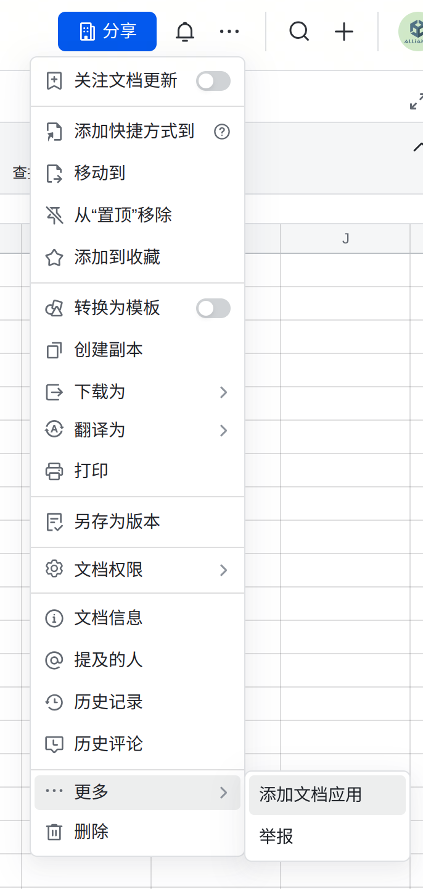

# 配置指南

## 配置项目

1. 拉取项目

   ```bash
   git clone git@github.com:Smoaflie/Alliance_Management_Feishu.git
   ```

2. 进入项目目录

   ```bash
   cd Alliance_Management_Feishu
   ```

3. 拉取docker镜像

   ```bash
   sudo docker compose pull
   ```

4. 配置端口映射

   > 项目默认使用3000端口接收回调，可自行修改
   >
   > 内网端口映射可考虑 `ngrok`或`cpolar`

5. 修改`setting.json`内相关配置

   ```json
   {
       "mysql": {	#如果使用docker compose，不需要修改
           "host": "mysql", #mysql数据库地址，docker容器之间可直接用`容器名`访问
           "user": "root",	#mysql数据库用户名
           "password": "mysql",	#mysql数据库密码
           "db": "managementDatabase",	#mysql数据库仓库名
           "port": "3306"	#mysql数据库端口
       },
       "sheet": {	#存储物资信息的飞书电子表格信息
           "token": "KlYDsOIVphwX8ItaJ90cf156n0s",	#电子表格的token
           "sheet_id_TOTAL": "3e1df5",	#电子表格中用于存储物资总量的工作表SheetId
           "sheet_id_ITEM": "eGygaA"	#电子表格中用于存储物资详细信息的工作表SheetId
       },
       "approval": {	#审批请求的配置信息
           "approval_code": "83CEE9CB-A6D5-4501-B509-4F53D7EBC1D9" #审批定义的标识
       },
       "redis": {	#如果使用docker compose，不需要修改
           "host":"redis", #redis数据库地址，docker容器之间可直接用`容器名`访问
           "port": 6379,	#redis数据库端口
           "db":0			#redis数据库仓库名
       }
   }
   ```

   > 其中，相关数据的获取：
   >
   > - `电子表格的token`: 
   >
   > 先在云文档中找到对应文档，右键-添加到置顶文档
   >
   > 
   >
   > 再从置顶文档中找到文档，右键-分享-链接
   >
   > 
   >
   > 
   >
   > 此时你会获得一串链接，形如:
   >
   > `https://test-d448xvfbetmh.feishu.cn/sheets/KlYDsOIVphwX8ItaJ90cf156n0s?from=from_copylink`
   >
   > 其中`KlYDsOIVphwX8ItaJ90cf156n0s`就是电子表格Token
   >
   > - `工作表SheetId`:
   >
   > 通过上述链接，在浏览器中打开电子表格
   >
   > 新建一个工作表
   >
   > 
   >
   > 在两个工作表间切换，观察浏览器地址栏变化为(形如)：
   >
   > `https://test-d448xvfbetmh.feishu.cn/wiki/VTGkwmoILiVxK5klVswcReSBndb?fromTtSwitch=1&sheet=3e1df5`
   >
   > 其中sheet=后的`3e1df5`就是当前工作表的`SheetId`
   >
   > - `审批定义的标识`:
   >
   > 请注意，新建审批是不可省略的步骤，因为不同审批间自定义Id不同
   >
   > 打开[审批管理后台-开发者模式](https://www.feishu.cn/approval/admin/approvalList?devMode=on)
   >
   > `+创建审批`
   >
   > 选择`物品领用模板`
   >
   > 自行设置基础信息，**但不要修改名称**
   >
   > 在表单设计中，按下图格式，只设置三个控件，并配置相应的自定义控件：
   >
   > 多行文本	-	do
   >
   > 日期	-	date
   >
   > 多行文本	-	objectList
   >
   > 
   >
   > `流程设计`和`更多设置`自行修改
   >
   > 发布审批
   >
   > 再次打开审批的配置页面，观察地址栏，链接形如：
   >
   > `https://www.feishu.cn/approval/admin/createApproval?id=7422551574788489220&devMode=on&definitionCode=83CEE9CB-A6D5-4501-B509-4F53D7EBC1D9`
   >
   > definitionCode=后面一串`83CEE9CB-A6D5-4501-B509-4F53D7EBC1D9`就是审批定义的标识

6. 往电子表格中塞入物品数据

   > sheet_id_TOTAL表 存储物资总数 
   >
   > 程序初始化时会从A2:D范围内提取物资信息初始化数据库
   >
   > 参考：
   >
   > 
   >
   > sheet_id_ITEM表 存储物资详细信息:
   >
   > 通过/save命令可将数据库信息备份到该表
   >
   > 通过/load命令可以将该表信息导入到数据库
   >
   > 参考:
   >
   > 

7. 参考下一节`配置飞书开发者后台`修改飞书应用配置文件`.env`

8. 启动容器

   ```bash
   sudo docker compose up
   ```

## 配置飞书开发者后台

1. 打开[飞书开发者后台](https://open.feishu.cn/app)

2. 点击`创建企业自建应用`创建一个应用

3. (可选)在正式部署前，你应该先在一个安全的环境内测试好所有的功能。

   > 从左侧列表进入 开发配置-测试企业和人员 
   >
   > 根据提示要求 创建测试企业，将应用版本切换为测试版本

4. 添加能力

   > 在 应用能力-添加应用能力 中，添加`机器人`

5. 配置机器人菜单

   > 应用能力-机器人-机器人自定义菜单
   >
   > 开启菜单能力，并设置响应动作为`推送事件`:`custom_menu.inspect.items`
   >
   > 

6. 从左侧列表中找到相关数据信息，修改根目录下`.env`配置信息

   > `APP_ID`和`APP_SECRET`：基础信息-凭证与基础信息-应用凭证
   >
   > `VERIFICATION_TOKEN`和`ENCRYPT_KEY(可选)`: 开发配置-事件与回调-加密策略
   >
   > `LARK_HOST`:https://open.feishu.cn 保持默认就好
   >
   > .env中有示例值，源于我的测试应用配置

7. 添加应用权限

   > 开发配置-权限管理
   >
   > 请开通以下权限：
   >
   > ~~（有些权限是不必要的，但我懒得筛了）~~
   >
   > aily:message:write
   >
   > application:application.bot.operator_name:readonly
   >
   > approval:approval
   >
   > approval:instance
   >
   > bitable:app
   >
   > contact:contact.base:readonly
   >
   > contact:user.base:readonly
   >
   > contact:user.employee_id:readonly
   >
   > contact:user.id:readonly
   >
   > docs:doc
   >
   > drive:drive.metadata:readonly	
   >
   > im:app_feed_card:write
   >
   > im:message
   >
   > im:message.p2p_msg:readonly
   >
   > im:message:readonly
   >
   > im:message:send_as_bot
   >
   > sheets:spreadsheet

8. (**进行这一步时，应先开启服务，并配置好端口映射)**设置回调地址，并订阅事件

   > 开发配置-事件与回调
   >
   > ​	事件配置-订阅方式-选择`将事件发送至 **开发者服务器**`:
   >
   > ​	回调配置-订阅方式-选择`将回调发送至 **开发者服务器**`
   >
   > ​	将请求地址设置为**映射到3000端口，外网可访问的链接**
   >
   > 订阅事件-添加以下事件:
   >
   > ​	im.message.receive_v1
   >
   > ​	approval_instance
   >
   > ​	application.bot.menu_v6

9. 设置版本号-发布应用

10. 给电子表格添加机器人权限

    > 如图：搜索你的机器人，添加
    >
    > 

使用指南请参考[使用指南.md](./使用指南.md)